```mermaid
flowchart LR
    subgraph Reads["📖 READS"]
        R1[config.json]
        R2[input.ts]
    end
    subgraph Writes["✍️ WRITES"]
        W1[output.json]
        W2[result.ts]
    end
    subgraph Network["🌐 NETWORK"]
        N1[GET /api/data]
    end
```

You are running inside a git repository using Claude Code. This Skill generates comprehensive workflow documentation for any Claude skill by analyzing its files and producing visual Mermaid diagrams.

## When Invoked

**Usage:** `/skill-docs-generator [skill-path]`

1. **If no path provided**, list available skills:
   ```bash
   ls -la .claude/skills/
   ```
   Then ask user which skill to document.

2. **Validate the skill exists:**
   ```bash
   test -d "{skill-path}" && echo "Found" || echo "Not found"
   ```

3. **Read all skill files** to understand the complete workflow:
   - Read `SKILL.md` or `README.md` for overview
   - Read all `.sh`, `.mjs`, `.js`, `.py`, `.ts` scripts
   - Read `config.json` if present
   - Read template files (`.tpl`, `.template`)

4. **Analyze each script** and extract:
   - Entry points (main functions, CLI arguments)
   - File reads and writes
   - Network/API calls
   - Process spawns (exec, spawn)
   - Decision points (if/else, switch)
   - Loops (for, while, forEach)
   - Error handling (try/catch)
   - Function call graph

5. **Generate Mermaid diagrams** for:
   - **Master Workflow**: Complete execution flow with stages
   - **Decision Trees**: Branching logic at key points
   - **Loop Diagrams**: Iterative processes
   - **File Operations**: Reads, writes, network calls
   - **Error Handling**: Error paths and recovery

6. **Output documentation** based on user preference:
   - **Option A**: Markdown file (`WORKFLOW.md` in skill directory)
   - **Option B**: React page (if `web/` exists with MermaidDiagram component)
   - **Option C**: Console output (diagrams for copy/paste)

## Analysis Checklist

For each script, capture:

### Entry Points
- [ ] How is it invoked?
- [ ] What arguments/flags?
- [ ] What preconditions?

### Stages
- [ ] Distinct execution phases?
- [ ] Order of operations?
- [ ] Data flow between stages?

### Decision Points
- [ ] Branching conditions?
- [ ] All possible paths?
- [ ] Default/fallback behaviors?

### Loops
- [ ] What iterates?
- [ ] Loop termination conditions?
- [ ] Nested loops?

### File Operations
- [ ] Files read (when, why)?
- [ ] Files written (when, why)?
- [ ] File formats?

### Network Operations
- [ ] APIs called?
- [ ] HTTP methods?
- [ ] Request/response data?

### Error Handling
- [ ] What errors can occur?
- [ ] How detected?
- [ ] Recovery mechanisms?
- [ ] Fatal vs recoverable?

## Mermaid Diagram Templates

### Master Workflow


### Decision Tree


### File Operations


### Error Handling


## React Page Generation (Optional)

If project has `web/src/components/MermaidDiagram.tsx`, generate a documentation page:

```typescript
// web/src/pages/{SkillName}Docs.tsx
import { useState } from 'react';
import { useSearchParams } from 'react-router-dom';
import { MermaidDiagram } from '../components/MermaidDiagram';

const DIAGRAMS = {
  masterWorkflow: `flowchart TB...`,
  decisionTree: `flowchart TD...`,
  fileOps: `flowchart LR...`,
  errorHandling: `flowchart TD...`,
};

export function {SkillName}Docs() {
  const [searchParams, setSearchParams] = useSearchParams();
  const activeTab = searchParams.get('tab') || 'overview';

  // Render tabs: Overview, Workflow, Decisions, Loops, Files, Errors
  // Each tab shows relevant diagrams using MermaidDiagram component
}
```

Also create:
- CSS file for styling
- Export in `pages/index.ts`
- Route in `App.tsx`
- Nav link in `Layout.tsx`

## Output Rules

- Never modify the skill being documented (read-only analysis)
- Write outputs to user-specified location or skill's directory
- Include both rendered diagrams AND raw Mermaid code
- Document every path, including edge cases
- Use consistent naming matching the source code
- Show data flow (inputs → outputs)
- Highlight decision points clearly
- Document failure paths as thoroughly as success paths

## Example Invocation

```
User: /skill-docs-generator .claude/skills/model-generator

Claude:
1. Reading skill files...
   - SKILL.md (overview)
   - run.sh (orchestration)
   - tools/analyze_repo.mjs
   - tools/fetch_enemy.mjs
   - tools/register_model.mjs
   - tools/validate_tsc.mjs

2. Analyzing workflow...
   - 5 stages identified
   - 3 decision trees
   - 2 loops
   - 12 file operations

3. Generating diagrams...

Where would you like the documentation?
A) WORKFLOW.md in skill directory
B) React page in web/src/pages/
C) Output to console
```
